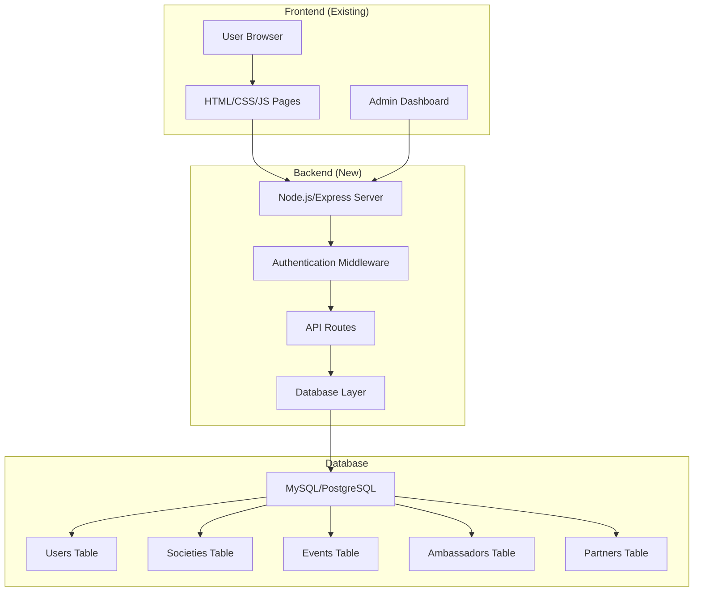

# Student Affairs Website Enhancement Plan

## Current Status Assessment
The website already has a solid foundation with:
- ✅ All required pages (Home, About Head, Team, Societies, Events, Ambassadors, Partners)
- ✅ NIIT-inspired color scheme implemented
- ✅ Responsive design with mobile navigation
- ✅ Interactive features (countdown timer, modals, sliders)
- ✅ Documentation in README.md

## Required Enhancements

### 1. Admin Panel with Backend
**Technology Stack:**
- **Backend**: Node.js with Express.js (or PHP with Laravel)
- **Database**: MySQL/PostgreSQL or MongoDB
- **Frontend**: Admin dashboard using existing CSS framework
- **Authentication**: JWT-based login system

**Admin Features:**
- User authentication (login/logout)
- Dashboard with statistics
- Content management for:
  - Societies (add/edit/delete society details)
  - Events (manage upcoming/past events)
  - Ambassadors (manage ambassador profiles)
  - Partners (categorize as platinum/diamond/gold)
  - Team members (update profiles)
- Image upload and management
- Countdown timer configuration
- Newsletter subscription management
- Export/import data functionality

### 2. Enhanced Documentation
- Update README.md with admin setup instructions
- Create API documentation
- Add deployment guide
- Include database schema documentation

### 3. Website Improvements
- Replace placeholder images with actual images
- Add form validation and submission
- Improve accessibility (ARIA labels, keyboard navigation)
- Performance optimization (image compression, lazy loading)
- Browser compatibility testing
- SEO optimization

## Architecture Diagram



## Implementation Phases

### Phase 1: Backend Setup
1. Set up Node.js/Express server structure
2. Configure database connection
3. Create database schema and tables
4. Implement basic CRUD API endpoints
5. Add authentication system

### Phase 2: Admin Dashboard
1. Create admin login page
2. Build dashboard layout with navigation
3. Implement society management interface
4. Create event management interface
5. Build ambassador/partner management
6. Add image upload functionality

### Phase 3: Frontend Integration
1. Connect existing pages to backend APIs
2. Replace static content with dynamic data
3. Add loading states and error handling
4. Implement form submissions

### Phase 4: Testing & Deployment
1. Unit and integration testing
2. Security testing (authentication, SQL injection)
3. Performance testing
4. Deployment configuration
5. Documentation updates

## Todo List for Implementation

### Backend Development
- [ ] Set up Node.js project with Express
- [ ] Install required dependencies (express, mysql2, bcrypt, jwt, multer, cors)
- [ ] Configure database connection
- [ ] Create database schema
- [ ] Implement user authentication (register/login)
- [ ] Create API endpoints for societies
- [ ] Create API endpoints for events
- [ ] Create API endpoints for ambassadors
- [ ] Create API endpoints for partners
- [ ] Implement image upload endpoint
- [ ] Add middleware for authentication and validation
- [ ] Write unit tests for API endpoints

### Admin Dashboard
- [ ] Create admin login page (admin-login.html)
- [ ] Build admin dashboard layout (admin-dashboard.html)
- [ ] Implement society management CRUD interface
- [ ] Build event management interface with date picker
- [ ] Create ambassador management with image upload
- [ ] Implement partner categorization (platinum/diamond/gold)
- [ ] Add statistics dashboard with charts
- [ ] Create user management interface
- [ ] Implement logout functionality

### Frontend Integration
- [ ] Update existing pages to fetch data from APIs
- [ ] Add loading indicators for dynamic content
- [ ] Implement error handling for API failures
- [ ] Update forms to submit to backend
- [ ] Add client-side validation
- [ ] Implement search functionality with backend support

### Testing & Documentation
- [ ] Test all API endpoints with Postman
- [ ] Perform cross-browser testing
- [ ] Test responsive design on mobile devices
- [ ] Security audit (XSS, CSRF protection)
- [ ] Update README.md with new features
- [ ] Create API documentation
- [ ] Write deployment guide
- [ ] Create user manual for admin panel

## Technical Specifications

### Database Schema
```
users
- id (PK)
- username
- email
- password_hash
- role (admin/user)
- created_at

societies
- id (PK)
- name
- description
- president_name
- vice_president_name
- member_count
- icon_class
- created_at

events
- id (PK)
- title
- description
- event_date
- event_type (upcoming/past)
- location
- image_url
- winners_details
- created_at

ambassadors
- id (PK)
- name
- university
- position
- bio
- image_url
- created_at

partners
- id (PK)
- name
- category (platinum/diamond/gold)
- description
- logo_url
- website_url
- created_at
```

### API Endpoints
```
GET    /api/societies          # List all societies
GET    /api/societies/:id      # Get society details
POST   /api/societies          # Create new society
PUT    /api/societies/:id      # Update society
DELETE /api/societies/:id      # Delete society

GET    /api/events             # List all events
POST   /api/events             # Create new event
PUT    /api/events/:id         # Update event
DELETE /api/events/:id         # Delete event

POST   /api/auth/login         # Admin login
POST   /api/auth/logout        # Admin logout
GET    /api/auth/verify        # Verify token

POST   /api/upload             # Image upload
```

## Success Criteria
1. Admin can log in and manage all website content
2. All existing pages display dynamic content from database
3. Image uploads work correctly
4. Website remains responsive and user-friendly
5. Security measures prevent unauthorized access
6. Documentation is comprehensive and up-to-date

## Estimated Timeline
The implementation will require approximately 4-6 weeks of development time, depending on the developer's experience and availability.

## Next Steps
1. Review and approve this plan
2. Set up development environment
3. Begin with Phase 1 implementation
4. Regular progress reviews and testing